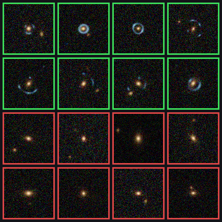
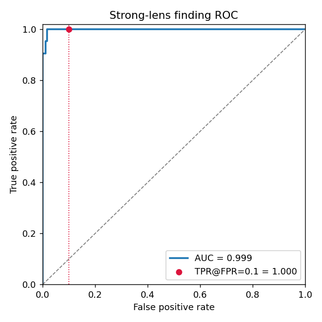
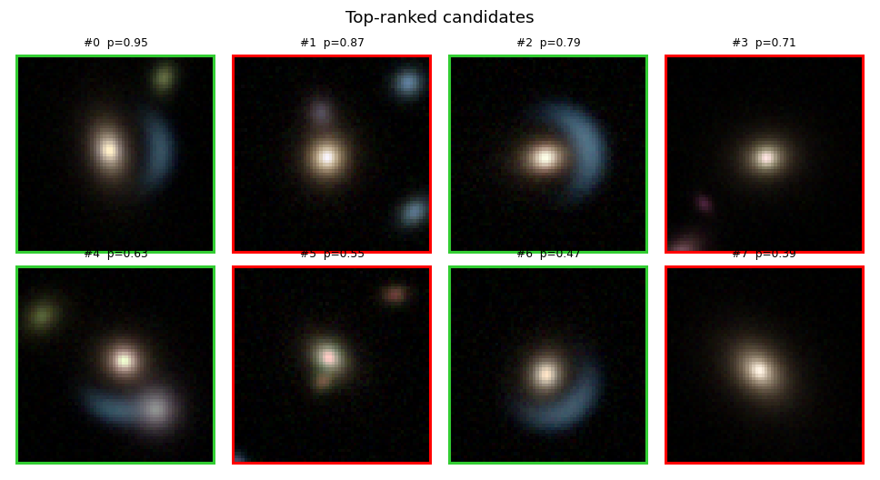
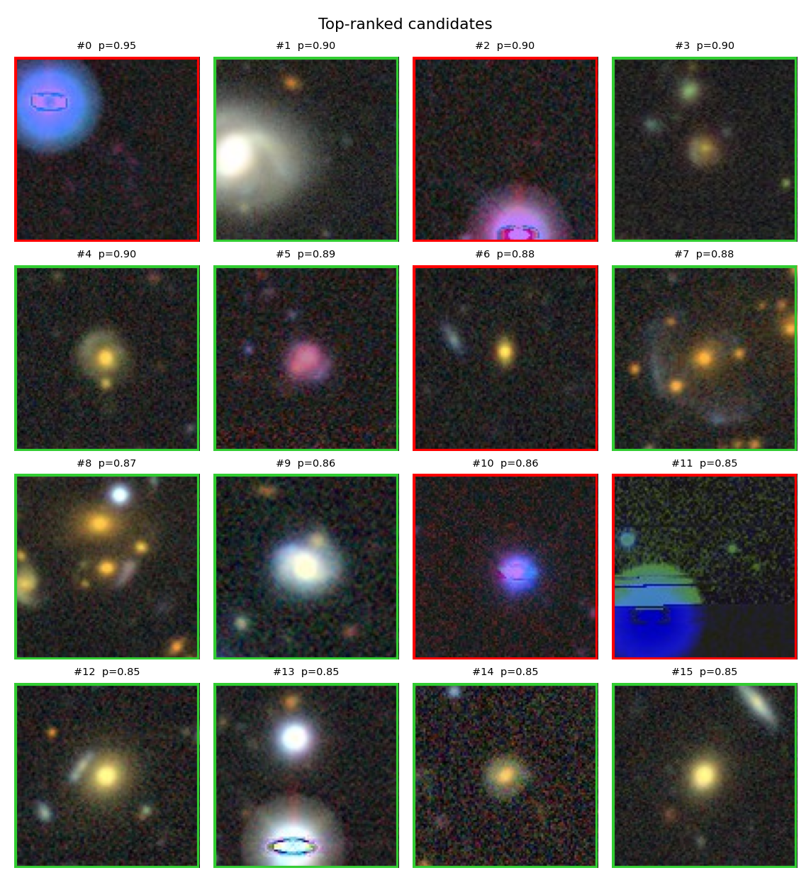
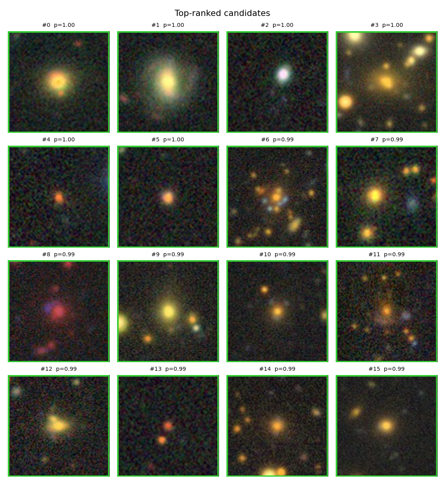

# DINOv3 Strong-Lens Finder

[](https://github.com/fabio-ag-silveira/DINOv3-Strong-Lens-Finder/actions/workflows/ci.yml)

Find **strong gravitational lenses** (arcs, Einstein rings) in wide-field survey
imagery by fine-tuning a **DINOv3** self-supervised vision backbone. Lenses are
~1 in tens of thousands of galaxies yet invaluable for measuring dark matter and
the Hubble constant — a textbook **needle-in-a-haystack ranking** problem and a
clean showcase for modern transfer learning.

The project's story: **train on physical simulations, then measure — and close — the
sim→real gap on real lenses** (see Results).



## Why DINOv3
- **Gram anchoring** keeps dense features sharp → optionally *localize* the arc with
  a segmentation head, not just classify.
- A **satellite-pretrained** variant narrows the domain gap to astronomical imaging.
- A full **size menu** (ViT-S/B/L + ConvNeXt) — small variants fit an 8 GB GPU.

## Install
```bash
git clone git@github.com:fabio-ag-silveira/DINOv3-Strong-Lens-Finder.git
cd DINOv3-Strong-Lens-Finder
pip install -e ".[sim,demo,notebook]"   # editable install with all extras
# or, without installing the package:  pip install -r requirements.txt
```

## Quickstart
```bash
# 1) physically-simulated training data (lenstronomy)
dino-lens simulate-physical --n-train 4000 --n-val 1000 --pos-frac 0.1

# 2) verify DINOv3 access (after `hf auth login` + accepting the licence)
dino-lens check-backbone

# 3) train, then evaluate -> metrics + ranked candidate list
dino-lens train  --config configs/default.yaml
dino-lens eval   --ckpt runs/exp1/best.pt --split val

# 4) real benchmark (server-free): build real cutouts, then evaluate
dino-lens make-lenscat --n-per-class 300 --val-frac 1.0 --out data/lenscat
dino-lens eval --ckpt runs/exp1/best.pt --index data/lenscat/index.csv --split val
#   (the canonical Bologna benchmark is also supported: see docs/bologna.md)

# 5) interactive demo
LENS_CKPT=runs/exp1/best.pt python app/gradio_app.py
```
No GPU yet? `pytest -q` runs a CPU end-to-end check with a tiny timm backbone.

## Results

**DINOv3 ViT-B + LoRA**, fine-tuned on lenstronomy simulations and evaluated on a
held-out simulated set (single RTX 5060, ~3 min): **ROC-AUC 0.999**, **TPR@FPR=0.1 = 1.0**, and the **top-16 ranked candidates are all true lenses** (green border):





> Simulated data is deliberately separable, so this validates the *pipeline*; the
> scientifically meaningful number is the **sim→real gap** below. Reproduce the
> figures on CPU (no GPU/DINOv3) with [`notebooks/results.ipynb`](notebooks/results.ipynb).

## Sim→real: measuring and closing the gap

The same DINOv3 + LoRA pipeline across three train→test regimes (single RTX 5060):

| Train → Test | ROC-AUC | TPR@FPR=0.1 |
|--------------|:-------:|:-----------:|
| Sim → Sim (held-out lenstronomy) | **0.999** | 1.00 |
| Sim → Real (lenscat + Legacy Survey) | **0.54** | 0.20 |
| Real → Real (fine-tuned on lenscat) | **0.94** | 0.89 |

Trained only on simulations, the model is **near-random on real lenses** — the
classic sim→real domain gap. It had latched onto a simulator-specific colour cue
(bluish arcs) and fired on blue stars/artifacts (red = false positive):



Fine-tuning on ~1.3k **real** cutouts **recovers AUC to 0.94** — the gap was domain
shift, not capacity. The top-ranked real candidates are now all true lenses:



> Caveat: the lenscat benchmark uses random-field negatives, so the real→real number
> is optimistic (a model can partly exploit *“is there a central galaxy?”*). See
> [docs/lenscat.md](docs/lenscat.md). The qualitative arc — large gap, then closed by
> real data — is robust.

## Docs
- [docs/usage.md](docs/usage.md) — full usage, config reference, DINOv3 access, 8 GB tips.
- [docs/architecture.md](docs/architecture.md) — module map and design decisions.
- [docs/lenscat.md](docs/lenscat.md) — **server-free real benchmark** (lenscat + Legacy Survey).
- [docs/bologna.md](docs/bologna.md) — canonical Bologna benchmark (access-restricted server).

## Layout
```
src/dino_lens_finder/   installable package (see docs/architecture.md)
configs/default.yaml    typed config (maps to dino_lens_finder/config.py)
app/gradio_app.py       interactive demo
tests/                  CPU smoke tests
assets/                 example imagery
```

## Notes
The lenstronomy simulator is a real lensing forward model (SIE + shear); the toy
generator (`simulation/toy.py`) exists only for the dependency-free test. DINOv3
weights use Meta's **DINOv3 License** (more restrictive than DINOv2's Apache-2.0) —
check it before commercial use.

## License
Code is released under the **MIT License** (see [`LICENSE`](LICENSE)). DINOv3 *weights* are governed by Meta's separate **DINOv3 License** — check it before commercial use.
